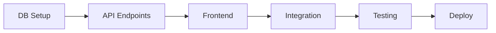

# 📅 7 Günlük Sprint Planı

5 yıl içinde küresel liderliğe giden yol haritasını destekleyecek **üretime hazır** platform için 7 günlük sprint planı.

---

## 🎯 Sprint Hedefi

**MVP'yi production'a deploy etmek** ve temel sipariş akışını çalışır hale getirmek.

---

## Gün 1: Temel Altyapı ✅

### Sabah (4 saat)
- [x] Project setup (Next.js, TypeScript, Tailwind)
- [x] Package.json ve dependencies
- [x] ESLint, Prettier, TypeScript config
- [x] Git repository init
- [x] .env.example oluşturma

### Öğleden Sonra (4 saat)
- [x] Prisma schema design
- [x] Database models (User, Product, Order, VideoJob)
- [x] Seed script
- [x] Initial migration

**Deliverable:** Çalışan database schema + seed data

---

## Gün 2: Core Backend Services ✅

### Sabah (4 saat)
- [x] Database client (lib/db.ts)
- [x] Logger setup (Pino)
- [x] Security utilities (validation, sanitization, rate limiting)
- [x] NextAuth configuration

### Öğleden Sonra (4 saat)
- [x] OpenAI adapter (chatbot + video script)
- [x] Twilio adapter (SMS/WhatsApp)
- [x] Stripe payment adapter
- [x] Video studio adapter (placeholder)

**Deliverable:** Tüm external service adapter'ları hazır

---

## Gün 3: API Endpoints ✅

### Sabah (4 saat)
- [x] POST /api/orders (sipariş oluşturma)
- [x] GET /api/orders (listeleme - admin)
- [x] PATCH /api/orders/[id] (durum güncelleme)
- [x] POST /api/chatbot

### Öğleden Sonra (4 saat)
- [x] POST /api/webhooks/stripe
- [x] POST /api/webhooks/twilio
- [x] POST /api/videos
- [x] GET /api/health
- [x] API testleri (unit)

**Deliverable:** Çalışan API endpoints + acceptance tests

---

## Gün 4: Frontend Core 🔄

### Sabah (4 saat)
- [x] Layout, Header, Footer
- [x] Ana sayfa (ürün kataloğu)
- [x] ProductCard component
- [x] Global styles (Tailwind)

### Öğleden Sonra (4 saat)
- [x] ChatbotWidget (UI + logic)
- [x] Chatbot integration (/api/chatbot)
- [ ] Order success/cancel pages
- [ ] Mobile responsive check

**Deliverable:** Kullanıcı tarafı MVP frontend

---

## Gün 5: Admin Panel 🎯 (BUGÜN)

### Sabah (4 saat)
- [ ] Admin layout & navigation
- [ ] Dashboard (KPI cards)
- [ ] Order list component (table/kanban)
- [ ] Order detail modal
- [ ] Status update UI

### Öğleden Sonra (4 saat)
- [ ] Video Studio UI
  - Template seçimi
  - Product picker
  - Generate button
  - Job status tracking
- [ ] Settings page (business info, working hours)
- [ ] User management (CRUD)

**Deliverable:** Çalışan admin panel

---

## Gün 6: Testing & Polish 🧪

### Sabah (4 saat)
- [ ] E2E tests (Playwright)
  - Complete order flow
  - Chatbot interaction
  - Admin order management
- [ ] Unit test coverage artırma
- [ ] Integration tests (API + DB)

### Öğleden Sonra (4 saat)
- [ ] Accessibility audit (WCAG AA)
- [ ] Performance optimization
  - Image optimization
  - Code splitting
  - Lighthouse score >90
- [ ] Security audit
  - OWASP checklist
  - Dependency vulnerabilities
- [ ] UI/UX polish

**Deliverable:** Test coverage >80%, performance optimize

---

## Gün 7: Production Deployment 🚀

### Sabah (3 saat)
- [ ] Vercel project setup
- [ ] Production env variables
- [ ] Database migration (production)
- [ ] Seed production data
- [ ] DNS configuration

### Öğleden Sonra (3 saat)
- [ ] Deploy to production
- [ ] Smoke tests
- [ ] Monitoring setup
  - PostHog analytics
  - Sentry error tracking
  - Uptime monitoring
- [ ] Webhook configuration
  - Stripe webhook URL
  - Twilio webhook URL

### Akşam (2 saat)
- [ ] Documentation review
- [ ] Handover belgeleri
- [ ] Launch checklist
- [ ] **GO LIVE! 🎉**

**Deliverable:** Production'da çalışan platform

---

## Post-Sprint (Gün 8-14)

### Haftanın Geri Kalanı

**Pazartesi:**
- Monitoring ve metrics inceleme
- Bug fixes
- Kullanıcı feedback toplama

**Salı:**
- Video generation provider entegrasyonu (Runway/Synthesia)
- Worker process optimize
- Queue monitoring

**Çarşamba:**
- iyzico ödeme entegrasyonu (Türkiye için)
- Çoklu dil (i18n) geliştirme
- Email notifications

**Perşembe:**
- Admin analytics dashboard
- Chart/graph components
- Export functionality (CSV, PDF)

**Cuma:**
- Performance tuning
- Load testing
- Scale testing
- Sprint retrospective

---

## Kritik Yol (Minimum Viable Product)

**Minimum çalışır sistem için gerekli:**
1. ✅ Database + Prisma
2. ✅ POST /api/orders endpoint
3. ✅ Ana sayfa + ChatbotWidget
4. ✅ Stripe payment flow
5. ✅ Twilio notification
6. [ ] Admin order management
7. [ ] Production deployment

---

## Risk Matrisi

| Risk | Olasılık | Etki | Mitigation |
|------|----------|------|------------|
| External API key gecikmeleri | Orta | Yüksek | Mock adapter'lar kullan |
| Database migration hataları | Düşük | Yüksek | Staging'de test et |
| Performance sorunları | Orta | Orta | Load testing + caching |
| Security açıkları | Düşük | Kritik | OWASP checklist + audit |
| Deployment hataları | Orta | Yüksek | Blue-green deployment |

---

## Success Metrics (MVP için)

### Teknik Metrikler
- [ ] Test coverage >70%
- [ ] Lighthouse performance >85
- [ ] API response time <500ms
- [ ] Zero critical security vulnerabilities
- [ ] 99.9% uptime (first week)

### Business Metrikler
- [ ] Chatbot completion rate >60%
- [ ] Order conversion rate (chatbot) >40%
- [ ] Average order processing time <5 min
- [ ] Customer notification delivery rate >95%

### User Experience
- [ ] Mobile responsive (all pages)
- [ ] WCAG AA compliance
- [ ] Page load time <3s
- [ ] Zero JavaScript errors (production)

---

## Şu Ana Kadar Tamamlanan ✅

### Gün 1-3 (Tamamlandı)
- [x] Proje iskeleti
- [x] Database schema
- [x] Lib katmanı (8 adapter)
- [x] API endpoints (7 route)
- [x] Temel frontend (5 component)
- [x] CI/CD pipeline (GitHub Actions)
- [x] Dokümantasyon (4 MD dosyası)

### Kalan Kritik İşler 🎯

**P0 (Bugün):**
1. Admin panel UI (4-6 saat)
2. Order management flow (2-3 saat)

**P1 (Yarın):**
1. E2E testler (3-4 saat)
2. Production deployment (3-4 saat)

**P2 (Post-launch):**
1. Video generation (real provider)
2. Advanced analytics
3. Email notifications
4. Multi-language

---

## Daily Standup Format

**Dün ne yaptım?**
**Bugün ne yapacağım?**
**Blocker var mı?**

---

## Sprint Retrospective (Gün 7 sonu)

### Değerlendirme Soruları
1. Ne iyi gitti?
2. Ne geliştirebiliriz?
3. Hangi problemler yaşandı?
4. Bir sonraki sprint için action items?

---

**Sprint Başlangıcı:** [Bugün]  
**Sprint Bitişi:** [7 gün sonra]  
**Sprint Hedefi:** MVP Production Deploy ✅
